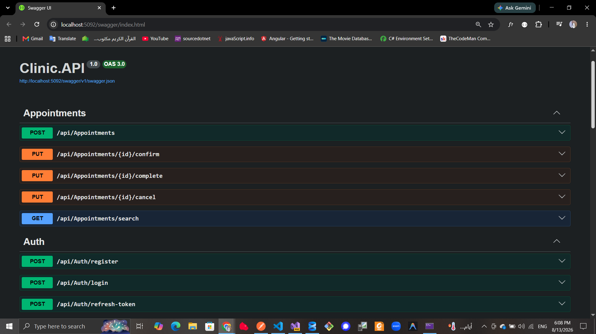
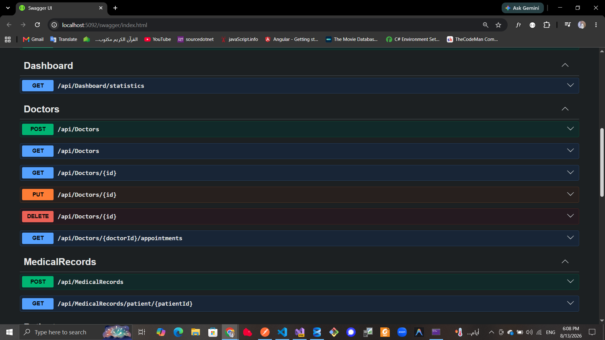
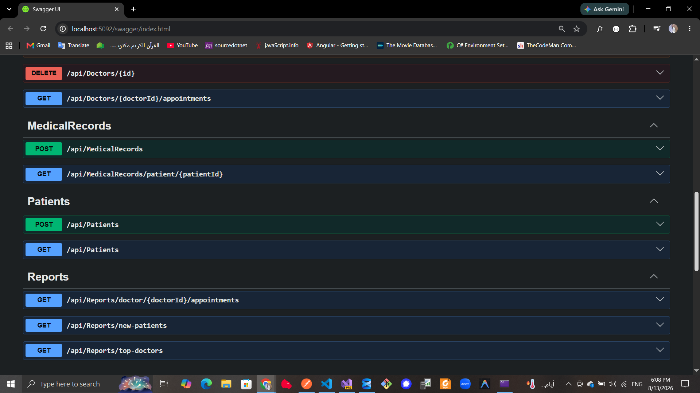

# 🏥 Clinic Management System - Backend

A scalable RESTful API for a Clinic Management System built with ASP.NET Core and designed using Clean Architecture principles.

The system provides backend services for managing doctors, patients, appointments, authentication, authorization, and clinic workflows.

---

## 🚀 Features

### 🔐 Authentication & Authorization

- User Registration
- User Login
- JWT Authentication
- Access Token Generation
- Refresh Token Support
- Secure Password Management
- ASP.NET Core Identity
- Role-Based Authorization

### 👨‍⚕️ Doctors Management

- Create Doctor
- Get Doctors
- Get Doctor By Id
- Update Doctor
- Delete Doctor
- Doctor Specialization Management

### 🧑‍🤝‍🧑 Patients Management

- Create Patient
- Get Patients
- Get Patient By Id
- Update Patient
- Delete Patient
- Patient Information Management

### 📅 Appointments Management

- Create Appointment
- Confirm Appointment
- Cancel Appointment
- Search Appointments
- Filter by Doctor
- Filter by Patient Name
- Filter by Appointment Status
- Filter by Date
- Pagination
- Appointment Status Management

---
## 📸 API Documentation

### 🔐 Authentication & Appointments



### 👨‍⚕️ Doctors



### 🧑‍🤝‍🧑 Patients


## 🏗️ Architecture

The project follows Clean Architecture principles to provide separation of concerns, maintainability, scalability, and testability.

```text
ClinicBookingSystem
│
├── Clinic.API
│   ├── Controllers
│   ├── Middleware
│   └── Configuration
│
├── Clinic.Application
│   ├── Features
│   │   ├── Auth
│   │   ├── Doctors
│   │   ├── Patients
│   │   └── Appointments
│   │
│   ├── Common
│   ├── DTOs
│   ├── Interfaces
│   └── Mappings
│
├── Clinic.Domain
│   ├── Entities
│   ├── Enums
│   ├── Identity
│   └── Common
│
└── Clinic.Infrastructure
    ├── Persistence
    ├── Repositories
    ├── Authentication
    ├── Identity
    └── Services
